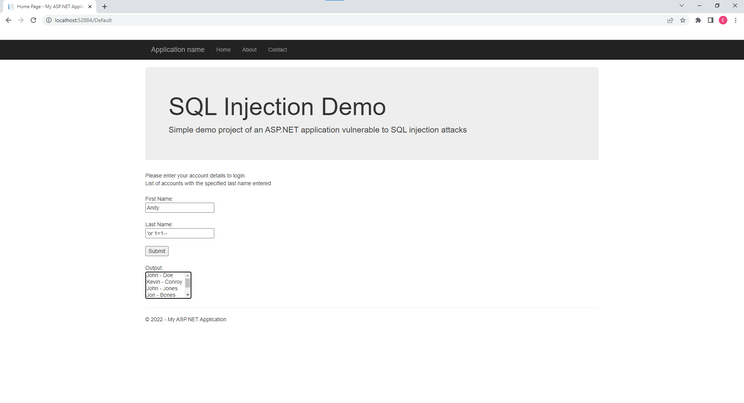
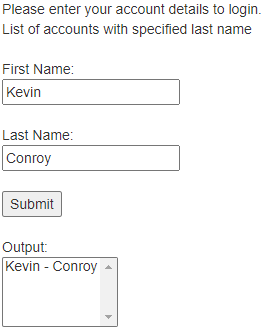
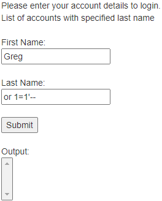
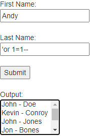

# SQL-Injection-Demo

## API8:2019 Injection Owner

### Intro

APIs present a very ideal and rich target for malicious actors. The nature of APIs is that they expose application logic as well as sensitive information, such as, Personally Identifiable Information (PII). Attackers are able to utilise input fields, such as *sign in* to inject malicious SQL queries which the database will validate and successfully execute.

### OWASP Definition

Read the full OWASP definition of this issue [here](https://github.com/OWASP/API-Security/blob/master/2019/en/src/0xa8-injection.md).

### Impacts

Potentially all PII information can be obtained if the attacker is able to acquire administrator access. Typically, if a SQL injection attack is successful then data loss, data theft, deletion of database tables, denial of service and a full system compromise can occur.

### Exploit and poor code practice

The [project created](https://github.com/Edward-P-Astbury/SQL-Injection-Demo) shows a simple example of a ASP.NET Web Application (.NET Framework) template project. A simplistic local database was created utilising Microsoft SQL Server Management Studio and SQL Server Express 2019 for demonstration purposes. 



For local re-creation purposes the following primitive database table was created:

``` sql
CREATE TABLE Names (
	id int IDENTITY(1,1) PRIMARY KEY,
	FirstName varchar(50),
	LastName varchar(50)
);
```

`Note:` Upon installation of SQL Server Express and Microsoft SQL Server Management Studio connection to the local db can be performed via entering `.\SQLEXPRESS` in the `Server name` input field.

A conventional entry into the database will be as follows:



However if the web application is insecure a bad actor can utilise the input fields to inject their own malicious SQL code. Firstly, the attacker will utilise some form of partial SQL to determine whether or not they can inject it into the data base. If `or 1=1'--` is passed into one of the input fields the resulting output is nothing:


But if we observe the database we will notice that a entry was inserted into the database with the SQL code:



What exactly is going on? Under normal circumstances the SQL query would look like this:

```sql
SELECT * FROM Names WHERE LastName = 'Bones'
```

The expected result from this query is that it would return all the records in the database where the `LastName` is that of Bones. However, if we append `or 1=1'--` we will notice that the query will look like this:

```sql
SELECT * FROM Names WHERE LastName = 'or 1=1'--'
```

The `--` in Transact-SQL (Microsoft's variant of SQL) represents commenting out code. This is utilised by attackers as a means of commenting out the single dash within the backend of the application. The statement itself prevents the interface from returning data as there is no explicit match for the last name of `or 1=1`. More importantly, this informs the attacker that they are able to inject some form of SQL that effectively allows them to modify the SQL statement within the web application itself due to the fact it would return nothing. At this stage the reconnaisse type behavior can now progress into an attack.

If the following partial SQL statement is entered into the form `'or 1=1--` the application will return all the records. This is a **major** vulnerability as the information could expose any potential user PII information that is not intended for the attacker to view.



The reason this is occurring is because within the database the following query is executed:

```sql
SELECT * FROM Names WHERE LastName = ''or 1=1--'
```

This results in all rows being returned because the `or` statement of `1=1` is always going to return true. Upon stealing the data the attacker can also opt in destroying the data via entering the partial SQL statement `'DELETE FROM NAMES --` which results in the following query being executed:

```sql
SELECT * FROM Names WHERE LastName = ''DELETE FROM Names --'
```

This is a serious issue as a attacker at this point is able to just pass in additional commands as they please into the database.

### Remediation

As shown before there is a issue with attackers exploiting input fields to inject partial SQL statements via clever SQL manipulation. The most prominent method of preventing SQL injection attacks is through **parameterized queries**.

Currently our backend employs the following concatenated inline query to present the output to the user:

```csharp
connect.SqlQuery("SELECT * FROM Names WHERE LastName = '" + txtBoxLastName.Text.Trim() + "'");
```

This type of code leaves our database vulnerable to the aforementioned potential exploits. Parameterized queries on the other hand function by ensuring the SQL engine checks each parameter is correct for its respective column and are treated as a literal entire string rather than as a part of the SQL to be executed. At no point are the user supplied values placed into the query, they are provided to the database separately, never forming part of the SQL query itself.

#### Correct code snippet of parameterized queries

```csharp
connect.SqlQuery("SELECT * FROM Names WHERE LastName=@LastName");
connect._command.Parameters.AddWithValue("@LastName", txtBoxLastName.Text.Trim());
```

**The full code snippet of the backend SQL functionality:**

```csharp
using System;
using System.Collections.Generic;
using System.Data;
using System.Linq;
using System.Web;
using System.Web.UI;
using System.Web.UI.WebControls;

namespace SQL_Injection_Demo
{
    public partial class _Default : Page
    {
        protected void Page_Load(object sender, EventArgs e)
        {

        }

        protected void btnSubmit_Click(object sender, EventArgs e)
        {
            try
            {
                SqlDbConnect connect = new SqlDbConnect();

                connect.SqlQuery("INSERT INTO Names (FirstName, LastName) VALUES (@FirstName, @LastName)");

                // Utilise parameters, good practice 
                connect._command.Parameters.AddWithValue("@FirstName", txtBoxFirstName.Text.Trim());
                connect._command.Parameters.AddWithValue("@LastName", txtBoxLastName.Text.Trim());

                connect.NonQuery();

                // POOR secure coding practice, uncomment this line to test injections
                //connect.SqlQuery("SELECT * FROM Names WHERE LastName = '" + txtBoxLastName.Text.Trim() + "'");

                // CORRECT secure coding practice, comment these two lines to disable SQL injection security
                connect.SqlQuery("SELECT * FROM Names WHERE LastName=@LastName");
                connect._command.Parameters.AddWithValue("@LastName", txtBoxLastName.Text.Trim());

                listBoxDatabase.Items.Clear();

                labelOutput.Text = "List of accounts with the specified last name entered";

                foreach (DataRow dataRow in connect.RetrieveQuery().Rows)
                {
                    listBoxDatabase.Items.Add(dataRow[1].ToString() + " - " + dataRow[2].ToString());
                }
            }
            catch (Exception ex)
            {
                labelOutput.Text = "Query error " + ex;
            }
        }
    }
}
```

This avoids string concatenation as we are using a placeholder for the variable and then passing it in with the `AddWithValue` method.

In addition, input validations need to be employed on both the client and server side. If programmed correctly if the input validation fails then the parameterized queries will not execute any scripted value. The input validation can vary, it could be not be only allowing a specified data type, such as, `string` or `integer` depending on the input field or utlising regular expressions to minimise the size and content from the user.
